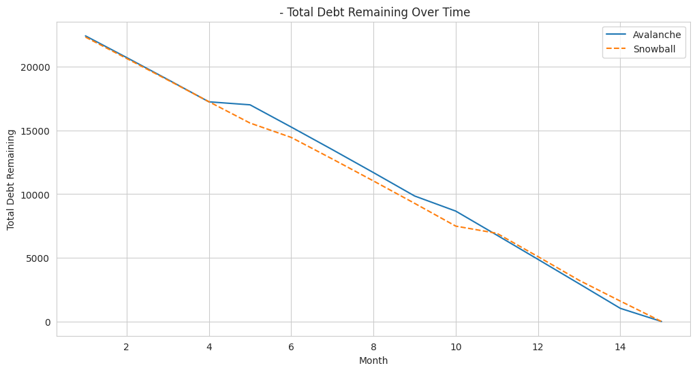
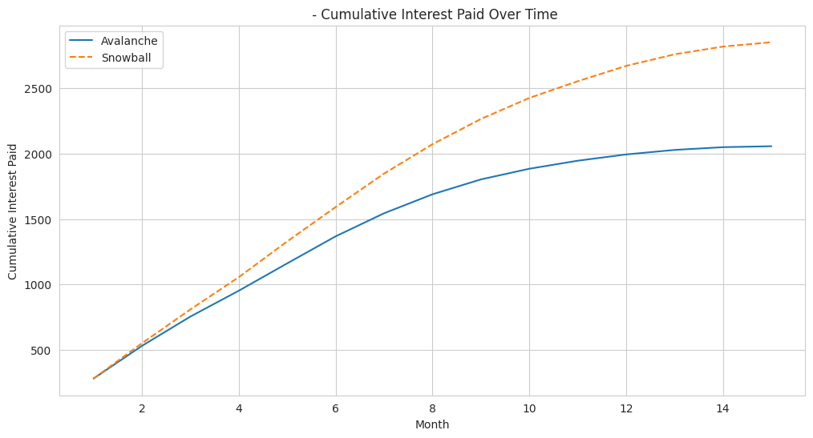
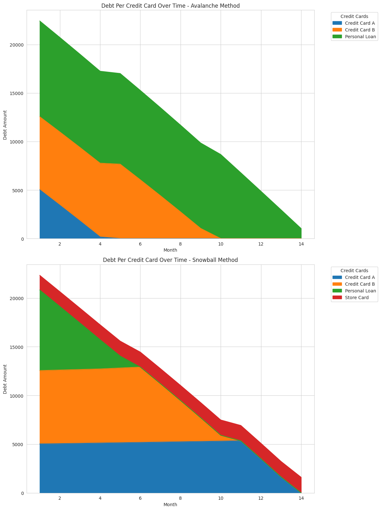

# 💳 Debt Payoff Simulator

## 🚀 Live App

**[Launch the Debt Payoff Simulator →](https://debt-payoff-simulator.streamlit.app)**

No signup. No data stored. Just cold, hard math vs your credit card debt.

---

A simulator that compares the **Avalanche** and **Snowball** debt repayment strategies using your own financial data. Calculates optimal payment distribution, tracks cumulative interest, and visualises payoff timelines — all with a dark theme and a healthy dose of financial reality checks.

## ✨ Features

| Feature | Description |
|---|---|
| **Strategy Comparison** | Avalanche (highest APR first) vs Snowball (lowest balance first) side-by-side |
| **Debt Health Score** | 0–100 score with grade and roast-level commentary |
| **Balance Transfer Simulator** | Model moving a balance to a 0% card — see if the fee is worth it |
| **Bi-weekly Payments** | Toggle bi-weekly to see how 13 annual payments saves interest |
| **Sensitivity Analysis** | "What if I paid $X more?" across multiple scenarios |
| **Debt-Free Countdown** | Big, motivating payoff date and progress display |
| **Interactive Charts** | Plotly charts with download buttons (PNG export) |
| **CSV Export** | Download your full month-by-month payment plan |
| **Promo APR Support** | Model 0% intro rates with expiry dates |
| **Summary Card** | Beautiful visual summary of your payoff plan |

## 📖 How to Use

1. **Enter your income and expenses** in the sidebar
2. **Add your debts** — name, balance, APR, minimum payment (promo rates optional)
3. **Choose payment frequency** — Monthly or Bi-weekly
4. **Hit "Run Simulation"** and explore the results
5. **Try the Balance Transfer analyzer** to see if consolidating makes sense
6. **Download your payment plan** as CSV for tracking

## Techniques Demonstrated

| Category | Details |
|---|---|
| **Financial Modelling** | Monthly interest accrual, APR expiry handling, minimum payment logic, balance transfers |
| **Strategy Comparison** | Avalanche (highest APR first) vs. Snowball (lowest balance first) |
| **Bi-weekly Payments** | 26 half-payments/year = 13 monthly equivalents for accelerated payoff |
| **Visualisation** | Interactive Plotly charts with human-friendly tooltips (dark theme) |
| **Sensitivity Analysis** | Parametric sweep across extra payment amounts |

## Example Outputs

| | |
|---|---|
|  |  |
|  | |

## Running Locally

### With pip

```bash
git clone https://github.com/DrKenReid/Debt-Payoff-Simulator.git
cd Debt-Payoff-Simulator
pip install -r requirements.txt
streamlit run app.py
```

### With Docker

```bash
docker build -t debt-sim .
docker run -p 8501:8501 debt-sim
```

Then open [http://localhost:8501](http://localhost:8501).

## A Note on Strategy Choice

In the example data, the Avalanche method saves roughly $795 in interest (28%) compared to Snowball, while both pay off debt in the same number of months. This is typical: Avalanche almost always wins on total cost. However, the Snowball method's psychological advantage — eliminating smaller debts quickly for motivation — is real and well-documented. The best strategy is the one you'll actually stick with.

## License

This project is licensed under [CC BY 4.0](LICENSE).
